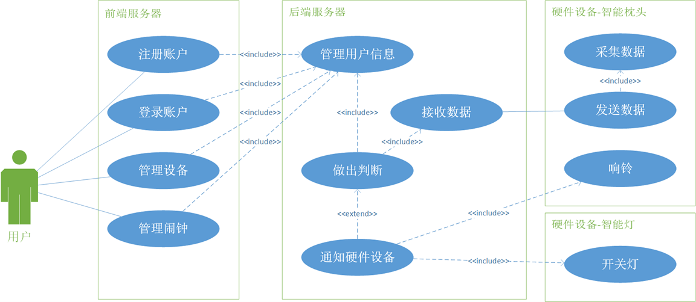
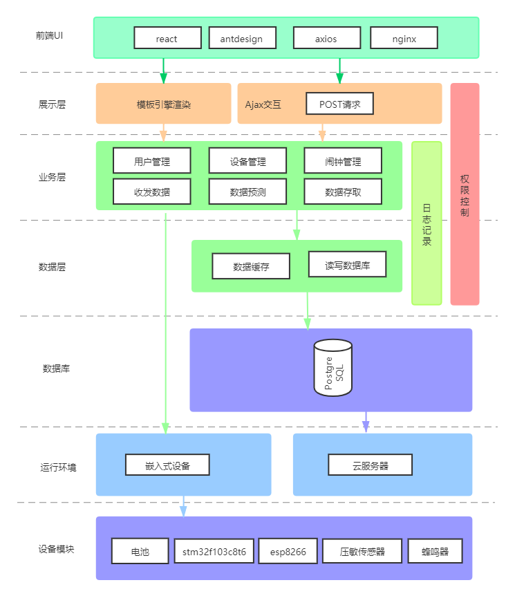
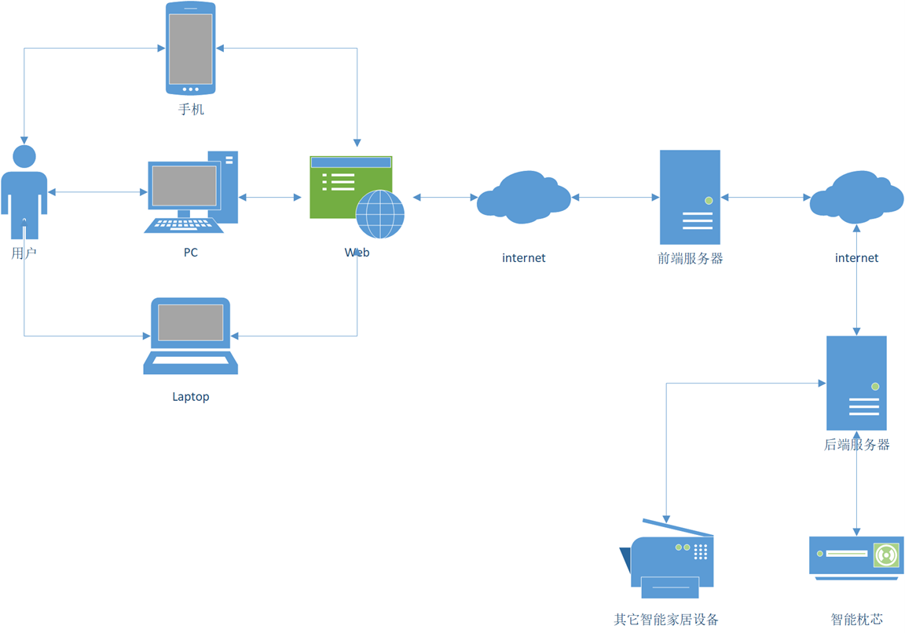

# Smart Pillow Project
## 详细信息
docs目录存放作品相关文档  
frontend 目录存放前端服务器代码，其介绍与详细信息见该目录下的 README  
hardware 目录存放嵌入式设备代码，其介绍与详细信息见该目录下的 README  
server 目录存放后端服务器代码，其介绍与详细信息见该目录下的 README  

# Introduction
智能枕芯是一个通过物联网技术，与其它智能家居互联互通的嵌入式设备。旨在利用最小的成本，最大化地提升用户生活水平与生活便利程度。

### 作品特色
1. 高性价比  
相比市场上价格上百的各种产品，我们的成本更加低廉，却可以有多的功能。由于所有部件都是零售购买，成本会比厂家大量生产高很多。我们的成本如下：stm32c8t6 最小系统板 8.6 元，如果是芯片的话只需要 5.15 元（淘宝价），esp8266-01S 淘宝价 5.8 元，薄膜压敏传感器 49 元，传感器配套模块 14.8 元，震动以及蜂鸣器合计 5 元，锂电池 6.4 元，其余杂项硬件材料费用 3 元，合计 92.6元。如果能够大量生产的话，通过更换传感器以及定制 PCB，预计成本可以到 40元。
2. 作为附件  
虽然如今市场上已经有了很多智能枕头产品，但是它们的功能大多都是辅助分析睡眠状态，而没有帮助将人唤醒的功能。此外市面上的智能枕头大多都为整个枕头形式的成品，价格较贵，且不能制定。而我们打算做的智能枕芯只是作为枕头的一个附件，垫在枕头下面就可以让普通枕头智能化。而且用户可以自己选择自己喜欢的枕头，附加上我们的产品，就能达到市面上智能枕头的效果，相当于每个用户都能自定义属于自己的智能枕头，对用户有更大的吸引力。
3. 互联互通  
它通过单片机将各种传感器收集到的数据，通过 WIFI 模块与云端服务器交互，并结合用户在网站上设置的各种信息，做出提升用户生活便利程度的决策，例如在用户睡觉的时候，自动关闭房间中的灯。此外，我们还在做了硬件上做了离线处理机制，确保了在一段时间内断网的情况下，任然可以正常工作。
4. 智能闹钟  
市面上现有的智能枕头大多都将目标放在改善用户睡眠情况上，而忽视了一些别的适合集成在智能枕头上的功能，比如智能闹钟。而我们做的智能枕头则添加了这一功能。它能获取用户在网页上设置的闹钟信息，并且在用户该起床的时候智能做出反应。比如，如果用户已经起床了，闹钟就会自动关闭，如果用户一直不起床，闹钟就不会停止，防止睡过。

# 概要设计
## 系统功能设计
我们的智能枕芯及其在云服务器上的相关程序提供了如下功能：
1. 用户可以注册登录账户。由于智能枕芯十分适合与其他的智能家居协同工作，比如小米，华为等提供的智能设备，登录的最佳方案是与第三方的账号绑定。但由于我们并没有相关的授权，所以登录与注册仅仅作为代替方案使用。
2. 管理设备，包括购买硬件之后根据指导添加设备到自己的账户，修改设备的名字方便记忆，与删除不用的设备。
3. 设置闹钟，通过闹钟设置的睡眠时间段，对同一用户的所有智能设备进行控制。比如在用户应该起床的时候，自动响铃，而在确保用户已经起床，或者是已经提前起床的情况下，自动关闭闹钟。这一点是目前其它智能家居很少做到的。此外，在用户晚上起床的时候，自动打开走廊上的灯，或者是在用户睡觉的时候，帮助用户进行自动关灯，解决了关灯后看不清的麻烦。

## 系统架构设计
我们系统架构一共分为7个层次，分别是 前端UI，展示层，业务层，数据层，数据库，运行环境与设备模块。

前端UI，展示层由前端发服务器来提供服务，主要是提供能够被用户访问的网页，并且将用户的操作传递给后端服务器。

业务层，数据层，数据库由后端服务器负责提供服务。业务层包括和前端服务器协作通讯完成用户管理，设备管理与闹钟管理，并且对数据库进行相应的读写操作。业务层还包括完成于硬件设备的通讯，接收硬件发送的数据，并且在做出预测之后将预测结果和用户在网站上的设置推送到硬件设备，以此完成智能的互联互通。同时后端服务器也包括对用户权限的控制与对必要过程的日志记录。

运行环境与设备模块则代表了系统功能与硬件的对应关系。其中前端服务器与后端服务器上的功能都是云服务器提供服务，确保能够24小时在线工作。而嵌入式设备则是我们的智能枕芯，设备模块着对应着智能枕芯在硬件上的组成。

## 物理架构设计
为了最大化的方便用户使用，比如在手机，笔记本和台式电脑上都可以轻松地访问我们的设置界面，我们通过前端服务器提供了通过web界面直接登录并进行设置的功能。同时考虑到在用户增多的情况下，服务器的负载会增加，我们采用了前后端分离的架构，提高了整个系统的承载能力。

